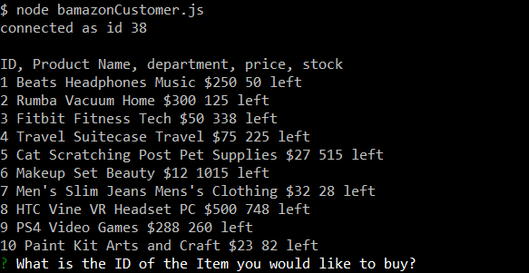
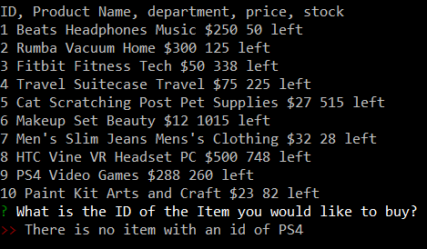
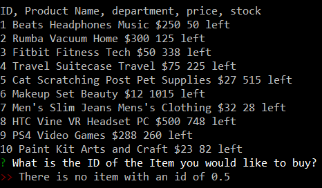
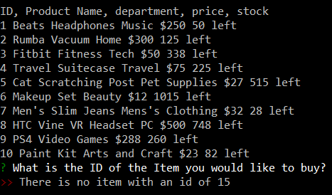
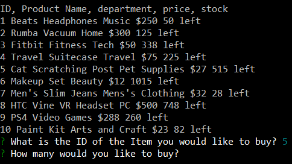
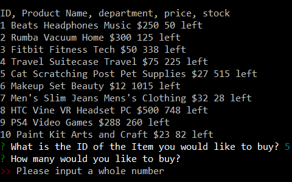
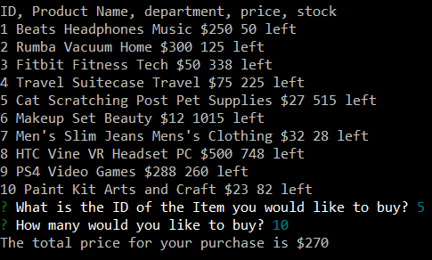
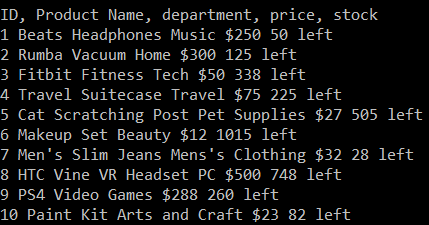

# bamazon

When the application first loads you will be shown all the aviable items that you can buy along with the item id number the name of the product the price and how many are currently in stock.

You have to enter the id of the item you want to buy. If you enter a wrong item id or the product name you will get a message saying that you need to enter the item id.

# Selection process

When you imput the correct id of the item that you want. You will then be asked how many of that Item you want. Just like the first prompt there is also validation.

# Calculating process

Once you are done selecting the product that you want the total will be reduced and you total amount you will pay will be shown at the bottom.

